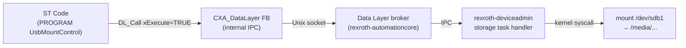

# Mounting USB Drives from ctrlX PLC Engineering — Without HTTP

*Published: 2026-04-20 | Platform: ctrlX OS ≥ 4.4 | Tags: ctrlX OS, PLC Engineering, CODESYS, Data Layer, USB, CXA_DataLayer*

---

## TL;DR

If you need to mount or safely eject a USB drive from ST code on ctrlX OS **≥ 4.4**, you do not need HTTP or any third-party library. Use the `DL_Call` function block from the built-in **`CXA_DataLayer`** library and POST a small JSON payload to `system/resources/tasks/storage/mountDevice`. That is the officially supported path — verified live on a ctrlX M4 running OS 4.6.

--
-
## The Problem

A common automation requirement: the PLC needs to trigger a USB-mount event programmatically — for example, to load a recipe file, save a log archive, or accept a firmware update delivered on a USB stick. The operator inserts the drive; the PLC is supposed to mount it, read or write data, and then safely eject it.

Developers familiar with REST APIs often reach for an HTTP client library as the first tool. The ctrlX REST API does expose a `/storage/api/v1/tasks` endpoint that does exactly this. The instinct is understandable, but it leads to a painful path:

- No officially supported HTTP client library exists for ctrlX PLC Engineering / CODESYS.
- Third-party CODESYS Store libraries require manual HTTPS/TLS handling against a self-signed device certificate.
- Every request requires a valid OAuth2 Bearer Token — your PLC program becomes responsible for token acquisition, refresh, and error recovery.
- Bosch Rexroth does not support or certify any of these libraries for use with ctrlX.

The good news: as of **ctrlX OS 4.4**, you do not need any of that. The USB mount/unmount functionality is exposed directly over the **ctrlX Data Layer** — the same IPC bus the PLC already uses internally.

---

## Prerequisites

| Requirement | Details |
|---|---|
| Hardware | ctrlX CORE X3, ctrlX M4, or any ctrlX CORE with a physical USB port |
| ctrlX OS | **≥ 4.4** — the storage task nodes were introduced in rexroth-deviceadmin 4.4 |
| Snap | `rexroth-deviceadmin` must be installed and running |
| PLC Engineering | ctrlX PLC Engineering with **`CXA_DataLayer`** library (included by default) |
| USB medium | FAT32 or ext4 formatted, physically connected before the mount call |

**How to verify your OS version:**  
Open the ctrlX web interface → *Settings* → *About*. Alternatively, read the Data Layer node `system/about` via DL_Read — the `firmwareVersion` field contains the OS version string.

> **Note:** The storage task nodes (`system/resources/tasks/storage/*`) are only present on real hardware. They do not exist on the ctrlX CORE virtual device because there is no physical storage provider active. If you test against a virtual core, DL reads on these paths will return `DL_INVALID_ADDRESS` (404).

---

## Background: Data Layer vs. REST on ctrlX

The ctrlX REST API and the ctrlX Data Layer are two different facades for the same backend. Every Data Layer node is reachable via both:

- **REST:** `GET/POST https://<ip>/automation/api/v2/nodes/<path>` — intended for external clients (Grafana, scripts, HMI web apps).
- **Data Layer FB:** `DL_Read` / `DL_Write` / `DL_Call` from `CXA_DataLayer` — intended for PLC programs running inside the device.

When your PLC code runs on the same ctrlX device, it communicates with the Data Layer over a local Unix socket. There is no TCP round-trip, no TLS handshake, and no token required. This is faster, simpler, and the path Bosch Rexroth actually supports for PLC use.

```
┌─────────────────────────────────────────────────────────┐
│                      ctrlX device                       │
│                                                         │
│  ┌─────────────────────┐     ┌──────────────────────┐   │
│  │  ctrlX PLC (snap)   │     │ rexroth-deviceadmin  │   │
│  │                     │     │       (snap)         │   │
│  │  PROGRAM UsbMount   │     │                      │   │
│  │    DL_Call ─────────┼─────┼▶ mountDevice handler │   │
│  │                     │ DL  │   │                  │   │
│  └─────────────────────┘     │   ▼                  │   │
│                               │  kernel mount()     │   │
│                               └──────────────────────┘   │
└─────────────────────────────────────────────────────────┘
```

The REST API (`/storage/api/v1/tasks`) is the path for external callers — an HMI web app, a Node-RED flow on a remote server, or a CI/CD script. Using it from within PLC code means routing a request out through the network stack and back in, adding all the authentication overhead, for no benefit.

---

## Approaches at a Glance

| Approach | Effort | Officially Supported | Recommendation |
|---|---|---|---|
| **Data Layer `DL_Call` from PLC** (OS ≥ 4.4) | Low | Yes | **Primary — use this** |
| HMI / WebIQ with `fetch()` against `/storage/api/v1/tasks` | Medium | Yes | Good if HMI is already in use |
| Node-RED as HTTP proxy, PLC triggers via Data Layer | Medium | Yes | Best for external HTTP calls; also the OS < 4.4 fallback |
| Restricted `user` account + WebBrowser widget in WebVisu | Low | Yes | Zero-code workaround, gives operator indirect UI access |
| Custom ctrlX snap (Python / Go) | High | Yes | Only for complex, generic automation needs |
| CODESYS Store HTTP client library | High | **No** | Not certified, not supported by Rexroth |
| SysSocket raw TCP HTTP(S) | Very high | No | **Strongly discouraged** |

The rest of this article focuses on the recommended path. The alternatives are described briefly in [Alternatives and Legacy Systems](#alternatives-and-legacy-systems).

---

## The Recommended Path: `DL_Call` on `system/resources/tasks/storage/mountDevice`

### Architecture



### Data Layer Node Reference

All three nodes were verified on a ctrlX M4 (OS 4.6, `rexroth-deviceadmin 4.6.0`) on 2026-04-20.

| Node path | DL operation | Purpose |
|---|---|---|
| `system/resources/tasks/storage/mountDevice` | `DL_Create` (POST) | Mount a USB drive |
| `system/resources/tasks/storage/unmount` | `DL_Create` (POST) | Safely unmount a drive |
| `system/resources/storage` | `DL_Read` (GET) | List all storage media with UUID and mount status |

**JSON schema — `mountDevice`** (from `types/storage/tasks/mountDevice`, verified):

```json
{
  "media":      "<UUID of the medium, e.g. '3C20-2F7A'>",
  "device":     "<partition name, e.g. 'sdb1'>",
  "assignment": "DataExchange"
}
```

`assignment` is an enum with two values:

| Value | Meaning |
|---|---|
| `"DataExchange"` | Normal USB file exchange — drive is mounted read/write under `/media/` |
| `"StorageExtension"` | Encrypted, device-bound storage extension — for persistent internal use only |

For typical USB file-exchange scenarios, always use `"DataExchange"`.

> **CamelCase matters:** The Data Layer schema uses `"DataExchange"` (CamelCase). The older REST API endpoint `/storage/api/v1/tasks` uses `"data-exchange"` (kebab-case) for the same field. If you mix them up you will get a validation error. This article covers the Data Layer path exclusively, so always use CamelCase.

**JSON schema — `unmount`** (from `types/storage/tasks/unmount`, verified):

```json
{
  "media":  "<UUID>",
  "device": "<partition name>"
}
```

---

### Step 1 — Add the `CXA_DataLayer` Library

In ctrlX PLC Engineering:

1. Open your project.
2. Navigate to **Extras → Library Manager**.
3. Click **Add Library** and search for `CXA_DataLayer` (published by Bosch Rexroth AG).
4. Confirm. The library is pre-installed with ctrlX PLC Engineering; no download required.

After adding, the `DL_Call` function block (and related `DL_Read`, `DL_Write`) will be available in the namespace `CXA_DataLayer`.

---

### Step 2 — Discover the USB Stick's UUID

Before you can mount, you need the `media` UUID and the `device` partition name of the USB stick. There are two strategies:

**Option A — Dynamic discovery via `DL_Read` on `system/resources/storage` (recommended for production)**

Read the node at startup or on a rising edge (e.g., when the operator signals "USB inserted"). The response is a JSON array of storage entries. Iterate over entries; the USB stick will have `"mounted": false` and will not be the internal SSD (`"internal": true` or `"device": "sda*"`).

Example response with a USB stick attached:

```json
{
  "storages": [
    {
      "uuid":    "7d60b16f-987e-4a34-832b-6a580eab8a37",
      "label":   "ubuntu-data",
      "device":  "sda6",
      "parent":  "sda",
      "format":  "ext4",
      "mounted": true,
      "size":    113952718848
    },
    {
      "uuid":    "3C20-2F7A",
      "label":   "MYUSBDRIVE",
      "device":  "sdb1",
      "parent":  "sdb",
      "format":  "fat32",
      "mounted": false,
      "size":    15726542848
    }
  ]
}
```

Parse the second entry: `uuid = "3C20-2F7A"`, `device = "sdb1"`.

**Option B — Fixed UUID (acceptable for single-stick scenarios)**

If always the same USB stick is used, read the UUID once via the web interface or a REST call, and hard-code it in the PLC variable initializer:

```iecst
sUuid   : STRING := '3C20-2F7A';
sDevice : STRING := 'sdb1';
```

---

### Step 3 — ST Code

The following program handles rising-edge-triggered mount and unmount. It is a minimal but production-usable pattern.

```iecst
(*
  UsbMountControl — Mount / unmount a USB drive via ctrlX Data Layer
  Library:  CXA_DataLayer  (built into ctrlX PLC Engineering)
  Requires: ctrlX OS >= 4.4  (rexroth-deviceadmin >= 4.4)
  Verified: ctrlX OS 4.6, rexroth-deviceadmin 4.6.0, 2026-04-20
*)

PROGRAM UsbMountControl
VAR
    (* Inputs — set from HMI or other program sections *)
    xDoMount      : BOOL;           (* Rising edge: trigger mount *)
    xDoUnmount    : BOOL;           (* Rising edge: trigger unmount *)
    sUuid         : STRING := '3C20-2F7A';   (* UUID of the USB medium *)
    sDevice       : STRING := 'sdb1';        (* Partition name *)

    (* Outputs — status bits for HMI *)
    xBusy         : BOOL;
    xDone         : BOOL;
    xError        : BOOL;
    uiErrorCode   : UINT;

    (* Internal *)
    fbDlCreate    : DL_Call;
    sPayload      : STRING(255);
    xMountActive  : BOOL;
    xUnmountActive: BOOL;
    xOldMount     : BOOL;
    xOldUnmount   : BOOL;
END_VAR

(* --- Rising-edge detection --- *)
IF xDoMount   AND NOT xOldMount   AND NOT xBusy THEN
    sPayload       := CONCAT('{"media":"', sUuid);
    sPayload       := CONCAT(sPayload, '","device":"');
    sPayload       := CONCAT(sPayload, sDevice);
    sPayload       := CONCAT(sPayload, '","assignment":"DataExchange"}');
    xMountActive   := TRUE;
    xUnmountActive := FALSE;
    xDone          := FALSE;
    xError         := FALSE;
    uiErrorCode    := 0;
END_IF

IF xDoUnmount AND NOT xOldUnmount AND NOT xBusy THEN
    sPayload       := CONCAT('{"media":"', sUuid);
    sPayload       := CONCAT(sPayload, '","device":"');
    sPayload       := CONCAT(sPayload, sDevice);
    sPayload       := CONCAT(sPayload, '"}');
    xUnmountActive := TRUE;
    xMountActive   := FALSE;
    xDone          := FALSE;
    xError         := FALSE;
    uiErrorCode    := 0;
END_IF

xOldMount   := xDoMount;
xOldUnmount := xDoUnmount;

(* --- DL_Call execution --- *)
(* DL_Call with eMethod = CREATE corresponds to an HTTP POST (DL_Create) *)
IF xMountActive OR xUnmountActive THEN
    fbDlCreate(
        xExecute  := TRUE,
        sNodePath := SEL(xMountActive,
                        'system/resources/tasks/storage/unmount',
                        'system/resources/tasks/storage/mountDevice'),
        eType     := DL_TYPE.STRING,
        sValue    := sPayload
    );

    xBusy := fbDlCreate.xBusy;

    IF fbDlCreate.xDone THEN
        xDone          := TRUE;
        xBusy          := FALSE;
        xMountActive   := FALSE;
        xUnmountActive := FALSE;
        fbDlCreate(xExecute := FALSE);   (* reset FB *)
    ELSIF fbDlCreate.xError THEN
        xError         := TRUE;
        xBusy          := FALSE;
        uiErrorCode    := UINT_TO_UINT(fbDlCreate.udiErrorCode);
        xMountActive   := FALSE;
        xUnmountActive := FALSE;
        fbDlCreate(xExecute := FALSE);   (* reset FB *)
    END_IF
END_IF
```

Key points:

- **`SEL(xMountActive, unmountPath, mountPath)`** — selects the node path without branching. `SEL` returns the second argument when the first is `TRUE`, third when `FALSE`.
- **`DL_TYPE.STRING`** tells the FB that the payload is a JSON string. The Data Layer broker handles the conversion to the typed schema internally.
- **Reset pattern:** After `xDone` or `xError`, call the FB again with `xExecute := FALSE` to reset its internal state machine before the next trigger.
- **`udiErrorCode`** maps to ctrlX Data Layer result codes. The most common: `0x80000001` = `DL_FAILED` (generic failure, e.g., no medium attached), `0x80000024` = `DL_INVALID_ADDRESS` (node does not exist — check OS version).

---

### Step 4 — Error Handling

| Symptom | Likely cause | Fix |
|---|---|---|
| `xError = TRUE`, `uiErrorCode = 0x80000024` | Node `system/resources/tasks/storage/mountDevice` does not exist | Upgrade to ctrlX OS ≥ 4.4, or check if `rexroth-deviceadmin` snap is installed |
| `xError = TRUE`, `uiErrorCode = 0x80000001` | No USB medium attached, wrong UUID, or device already mounted | Verify UUID via `system/resources/storage`; check `mounted` field |
| `xBusy` stays `TRUE` forever | DL broker overloaded or `rexroth-deviceadmin` not responding | Check snap status via ctrlX web interface; reboot if necessary |
| `DL_Call` FB not found in compiler | `CXA_DataLayer` library not added | Library Manager → Add `CXA_DataLayer` |
| Mount succeeds but files not accessible | Wrong `assignment` value used | Use `"DataExchange"` for file exchange; `"StorageExtension"` binds storage encrypted to the device |

---

## Alternatives and Legacy Systems

### OS < 4.4: Node-RED as HTTP Proxy

If the target device runs ctrlX OS < 4.4, the `system/resources/tasks/storage/*` nodes do not exist. The recommended fallback is **Node-RED as an HTTP proxy**:

1. Install the Node-RED app from the ctrlX Store.
2. In the Node-RED flow: Data Layer Input node (triggered by the PLC writing to a custom DL node) → HTTP Request node (POST to `https://localhost/storage/api/v1/tasks`) → Data Layer Output node (status back to PLC).
3. Node-RED has direct localhost access and can acquire Bearer Tokens via a dedicated auth sub-flow.

This keeps all HTTP complexity out of the PLC program. The PLC only writes a trigger value to a Data Layer node; Node-RED handles the HTTP call.

### HMI / WebIQ

If a web HMI (WebIQ, ctrlX HMI) is already running, it can issue the REST call directly via `fetch()`. This is a valid and supported path for HMI-triggered mounts where the operator interaction is in the web UI.

### Zero-Code: Restricted User + WebBrowser Widget

Create a ctrlX user with only the `storage` role. That user's web session shows only the Storage section. Embed that limited web interface in a CODESYS WebVisu panel via the `WebBrowser` widget — the operator mounts the drive through the built-in UI without needing to know the device address or credentials. This is a pragmatic workaround when programmatic control is not required.

---

## Security Considerations

- **Data Layer permissions:** The ctrlX PLC Engineering snap (`rexroth-plcengineering`) has Data Layer access to `system/resources/tasks/storage/*` by default. No additional permission grant is needed — but review your AppArmor profile if you have customized the snap environment.
- **No credentials in project code:** The Data Layer path requires no tokens or passwords in the ST program. This is one of its key advantages over the REST approach, which would require embedding or managing a Bearer Token.
- **USB as an attack surface:** USB drives can carry malware or be used for unauthorized data exfiltration. Consider whether automated mounting is appropriate for your security context. Where possible, restrict who can physically access the USB port and log mount/unmount events by reading `system/resources/storage` before and after.
- **`StorageExtension` vs. `DataExchange`:** Never use `StorageExtension` for ordinary file transfer. Storage extensions are encrypted and bound to the specific device — data written to a `StorageExtension` drive cannot be read on another machine.

---

## Troubleshooting Checklist

1. **Node returns `DL_INVALID_ADDRESS`:**  
   → ctrlX OS < 4.4, or `rexroth-deviceadmin` snap is not installed / not running.  
   → Check: ctrlX web UI → *Apps* → verify `rexroth-deviceadmin` is active.

2. **Node returns `DL_FAILED` immediately:**  
   → No USB medium inserted, or the medium is already mounted.  
   → Read `system/resources/storage` and check the `mounted` and `uuid` fields.

3. **UUID or device name mismatch:**  
   → Different USB sticks may have different UUIDs and partition names (`sdb1` vs. `sdc1`).  
   → Use Option A (dynamic UUID discovery) in production.

4. **`DL_Call` FB not visible in PLC Engineering:**  
   → Library `CXA_DataLayer` is not added to the project.  
   → Extras → Library Manager → Add Library → search `CXA_DataLayer`.

5. **Mount succeeds but PLC cannot read files:**  
   → The PLC snap's AppArmor profile may not grant access to `/media/`.  
   → Use the ctrlX Data Layer file-access mechanisms or the `rexroth-filestorage` snap for programmatic file I/O from PLC code.

6. **Works on real hardware, fails on virtual core:**  
   → Expected. The storage task nodes require a physical storage provider.  
   → Test file-based logic separately; test the DL_Call itself only on hardware.

---

## Conclusion

For USB mount/unmount from ctrlX PLC Engineering, the correct tool is `DL_Call` on `system/resources/tasks/storage/mountDevice` — not an HTTP client library. The Data Layer path is shorter, faster, officially supported, and requires no credentials management in PLC code.

The general principle extends beyond storage: whenever a PLC on ctrlX OS needs to interact with another ctrlX service running on the same device, check whether that service exposes a Data Layer node first. REST is the right choice for external clients crossing a network boundary; the Data Layer is the right choice for in-device communication.

---

## References and Further Reading

**[1] Community: Mount and remove safety USB from Datalayer (PLC or Node Red)**  
https://community.boschrexroth.com/ctrlx-core-25gnfzl4/post/mount-and-remove-safety-usb-from-datalayer-plc-or-node-red-5fn56hKDAZRATPF  
Best Reply by *CodeShepherd* (Bosch Rexroth moderator) confirms the `system/resources/tasks/storage` path from OS 4.4 onward.

**[2] Community: USB mount/remove commands via PLC**  
https://community.boschrexroth.com/ctrlx-core-25gnfzl4/post/usb-mount-remove-commands-via-plc-MnSgAKZqsSeZCzi  
WebBrowser-widget workaround with a restricted storage user.

**[3] ctrlX Automation SDK — Storage Extension documentation**  
https://boschrexroth.github.io/ctrlx-automation-sdk/4.6.0/storage-extension.html  
Covers the `StorageExtension` assignment type (encrypted, device-bound) — distinct from the `DataExchange` use case described here.

**[4] ctrlX Automation SDK — Data Layer documentation**  
https://github.com/boschrexroth/ctrlx-automation-sdk/blob/main/doc/datalayer.md  
Architecture overview, REST API v2, node addressing conventions.

**[5] CXA_DataLayer library reference**  
https://docs.automation.boschrexroth.com/doc/593878435/cxa-datalayer/latest/en/  
Function block reference for `DL_Read`, `DL_Write`, `DL_Call` and related types.

**[6] ctrlX CORE REST API overview**  
https://boschrexroth.github.io/rest-api-description/ctrlx-automation/ctrlx-core/index.html  
OpenAPI descriptions for all ctrlX CORE REST APIs, including `/storage/api/v1/tasks`.

**[7] ctrlX PLC App, Application Manual EN (Rev 03)**  
`R911423401_03_ctrlX PLC, App, ApplicationManual_EN.pdf` — Chapter 6: Data Layer Connection.

---

*Verified on: ctrlX M4 · ctrlX OS 4.6 (Ubuntu Core 24) · rexroth-deviceadmin 4.6.0 · 2026-04-20*
